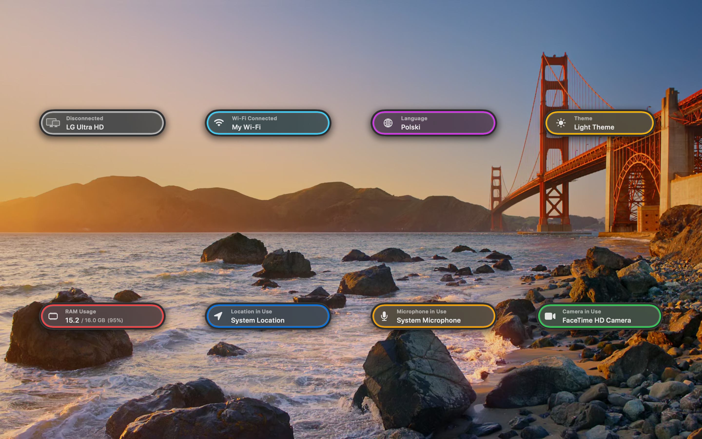
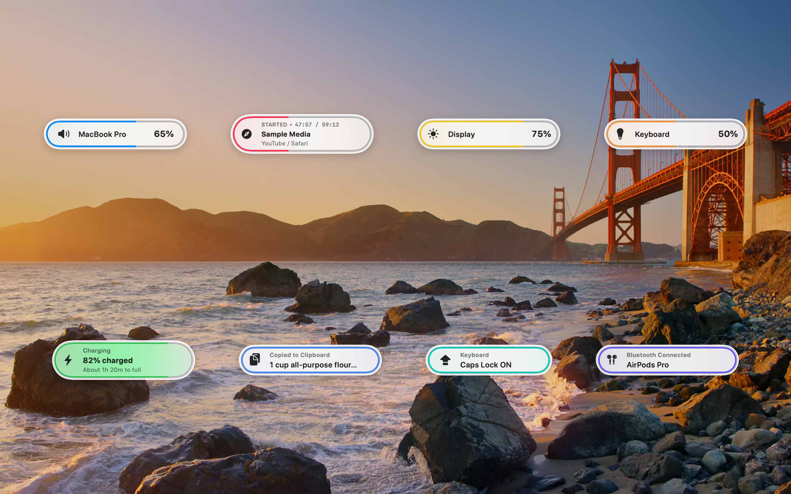
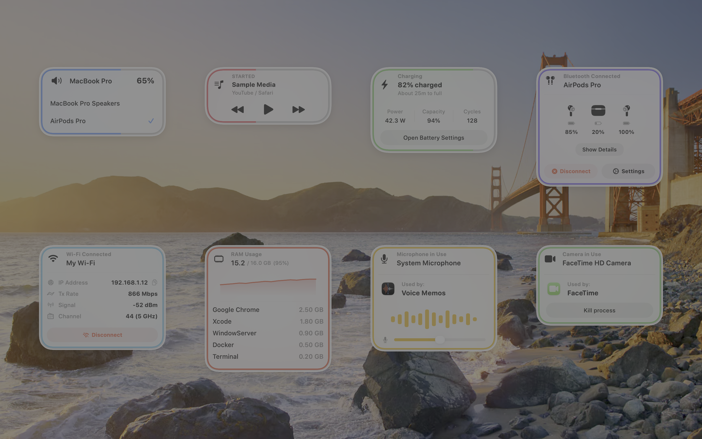

# VisorPro

VisorPro is an advanced, fully native macOS utility designed to elevate your system experience by providing sleek, customizable on-screen displays (OSD) and trackers for everyday system events. Say goodbye to the native macOS volume and brightness overlays, and embrace a modern aesthetic that seamlessly integrates with your workspace.

## ✨ Features

- **100% Native & Fast**: Built entirely in Swift and SwiftUI. Universally optimized for maximum performance on both **Apple Silicon (M-series)** and **Intel** processors.
- **Interactive OSD Overlays**: Overlays are fully clickable. Interact with them to expand panels, change system states, or reveal more information on demand.
- **6 Screen Positions**: Total layout freedom. Choose from 6 different locations on your screen to place the overlays exactly where they suit you best.
- **Audio Feedback**: Set a custom invocation sound that subtly plays whenever an overlay appears on your screen.
- **Ultimate Customizability**: Granular control via a rich Settings dashboard. You can freely toggle individual overlays on or off, tweaking their behavior to match your needs.
- **System Trackers**: Real-time monitoring for Battery, Wi-Fi, Bluetooth, Peripherals, and Mac System states (CPU, RAM).
- **Media Controls**: Enhanced visual feedback when playing/pausing or skipping media.

## 🖼️ Overlay Styles

VisorPro offers multiple themes and layouts. Overlays react smoothly to your input and adapt to your workflow.

---

### 🌙 Dark Mode

Designed to blend seamlessly with macOS Dark Mode, utilizing native background blurs.

<br>



---

### ☀️ Light Mode

A bright, frosted-glass appearance that fits perfectly into daytime setups.

<br>



---

### 📊 Expanded View (Interactive)

Click on overlays to expand them into a rich dashboard showing real-time metrics like CPU/RAM usage, battery health, Wi-Fi, and connected peripherals.

<br>



---

## 🚀 Requirements

- **macOS**: macOS 14.0 (Sonoma) or newer.

## 🛠 Installation

### 1. Download Pre-built Release (Recommended)
You can easily install VisorPro by downloading the latest release directly:
1. Navigate to the [Releases](https://github.com/sonor-studio/VisorPro/releases) page.
2. Download the latest `.dmg` file.
3. Open the downloaded `.dmg` and drag the VisorPro app into your `Applications` folder.

### 2. Build from Source
If you prefer to compile the application yourself (requires Xcode 15.0+):
1. Clone this repository:
   ```bash
   git clone https://github.com/sonor-studio/VisorPro.git
   ```
2. Open `VisorPro.xcodeproj` in Xcode.
3. Select your Mac as the build destination and press `Cmd + R` to build and run.

## 🔓 Gatekeeper Workaround (Unsigned App)

Because VisorPro is an independent, open-source project and is not signed with a paid Apple Developer account certificate, macOS Gatekeeper may block it upon the first launch. You might see a warning that the app is from an "unidentified developer" or is "damaged and can't be opened."

This is standard macOS behavior for unsigned apps. **To safely bypass this and open VisorPro, use one of the following methods:**

### Method 1: System Settings
1. Try to open the app normally from your Applications folder. If a warning dialog appears, click **OK**.
2. Open **System Settings** > **Privacy & Security**.
3. Scroll down to the **Security** section.
4. You should see a message stating that VisorPro was blocked. Click the **Open Anyway** button.
5. Provide your Mac password if prompted, and click **Open** on the final warning dialog.

### Method 2: Terminal (For "Damaged" errors)
If macOS insists the app is "damaged and should be moved to the Trash," it means the system added a quarantine attribute. You can safely remove it via Terminal:
```bash
xattr -cr /Applications/VisorPro.app
```
*(Make sure to adjust the path if your app is located elsewhere).*

## 🤝 Contributing & Feedback

We welcome your ideas, bug reports, and feature requests! 

- **In-App**: You can easily send us your thoughts directly using the built-in **Feedback** tab inside VisorPro's settings.
- **GitHub**: Feel free to open an issue or submit a pull request on this repository.

## 📄 License

This project is licensed under the Creative Commons Attribution-NonCommercial-ShareAlike 4.0 International License (CC BY-NC-SA 4.0) - see the [LICENSE.txt](LICENSE.txt) file for details.
